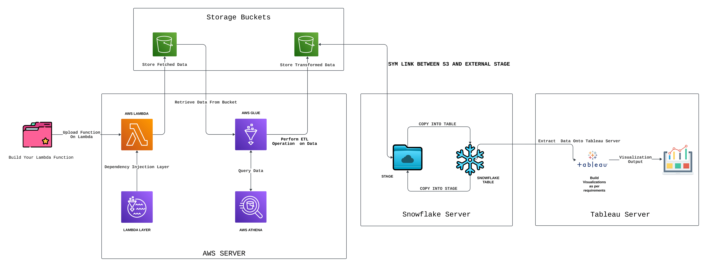
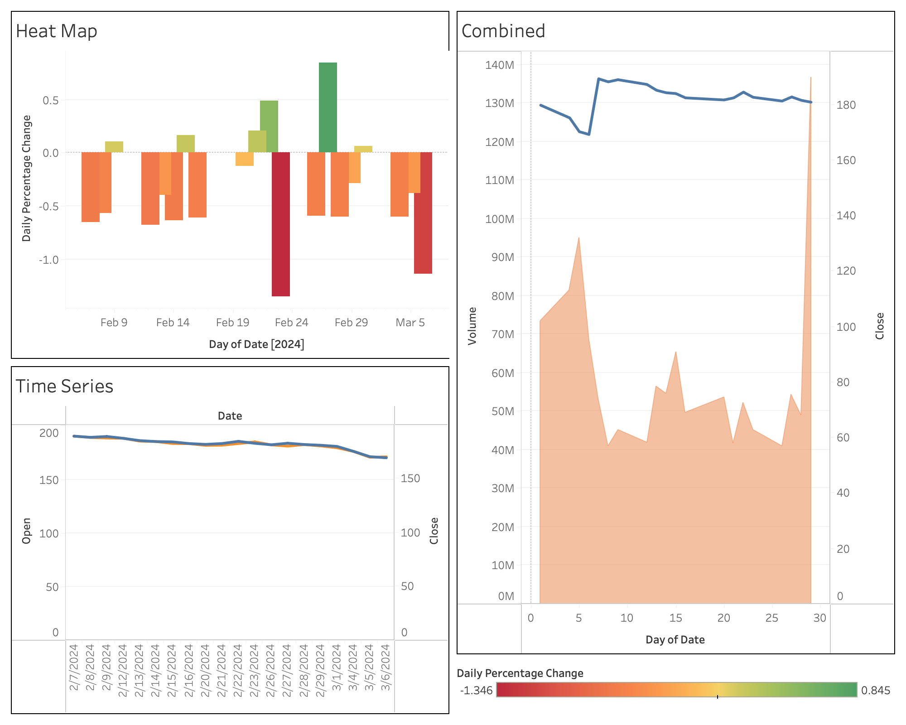

# Stock Data Visualization Pipeline

## Project Overview

This project is designed to fetch, transform, and visualize stock market data using a series of AWS services, Snowflake, and Tableau. The pipeline is divided into two main parts: data acquisition and storage on AWS, and data staging and visualization using Snowflake and Tableau.

## Architecture

The workflow consists of the following steps:

1. **Data Fetching**: An AWS Lambda function retrieves stock data from the internet using the `yfinance` library. Dependency injection via a Lambda layer is employed to include any necessary dependencies during the function execution.
2. **Data Storage**: The fetched data is stored in an AWS S3 bucket.
3. **ETL Process**: AWS Glue is used to crawl through the stored data and perform ETL operations based on selected criteria. The transformed data is saved back to S3 in CSV format. AWS Athena is utilized for querying data as needed.
4. **Data Staging in Snowflake**: The processed data in S3 is connected to Snowflake, where it is staged on the Snowflake server and stored in a Snowflake database.
5. **Visualization with Tableau**: Finally, the data in the Snowflake server is used to build visualizations in Tableau according to the project requirements.

## Technologies Used

- AWS Lambda
- AWS S3
- AWS Glue
- AWS Athena
- Snowflake
- Tableau
- Python (yfinance library)
- Lambda Layers for dependency management

## Setup and Configuration

### AWS Setup

1. **Lambda Function**: Create a Lambda function to fetch stock data using the `yfinance` library. Configure a Lambda layer for dependencies if necessary.
2. **S3 Bucket**: Set up an S3 bucket to store fetched and transformed data.
3. **AWS Glue**: Configure an ETL job in AWS Glue to process the data according to your criteria.
4. **AWS Athena**: Utilize Athena for querying data directly from S3 as required.

### Snowflake Configuration

1. Connect Snowflake to your S3 bucket to access the processed data.
2. Configure staging areas in Snowflake to load the data from S3.
3. Create tables in Snowflake to store the data for visualization.

### Tableau Integration

1. Connect Tableau to the Snowflake server.
2. Design and build dashboards based on your visualization requirements.

## Project Diagram

Refer to the attached flowchart diagram for an overview of the project's architecture.

## Visualization Output

The final output of the project is a set of Tableau dashboards visualizing the stock data according to the specified requirements.

## Conclusion

This project demonstrates a complete pipeline for fetching, processing, and visualizing stock market data using AWS services, Snowflake, and Tableau. It showcases the integration of various cloud and visualization technologies to derive meaningful insights from stock data.

## License

Romil Tiwari

